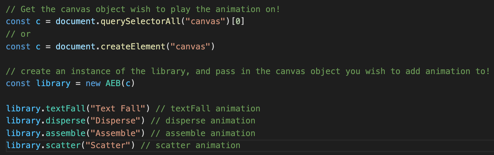

# js-library-huang853

# This repo contains individual project for huang853 (version: final)

## Project Name : Animation Enrichment Bundle (AEB)

#### The website is : [Animation Enrichment Bundle](https://salty-fortress-52521.herokuapp.com)

## Introduction
  This library's primary function is to plot text with points on any canvas object and let the user interact with those points by utilizes the canvas element and javascript's animation feature.

  The majority of the settings are customizable, you can change the radius, starting location, text to present, color, and a lot more. 
  
  The library is suitable for both beginners and advanced users, all the default value (except the canvas) are pre-setted (see documentation page for detail), and can be changed!
  
## Text Fall Animation
Ploting the passed in text using points on canvas.

After clicking on canvas, the points will start to bounce around inside the canvas!

Clicking more than once will result in the points to accelerate.

#### [link to Text Fall demo](https://salty-fortress-52521.herokuapp.com/textFall.html)

## Disperse Animation
Ploting the passed in text using points on canvas.

Moving the cursor close to the points will result them to first scatter, then comes back if the cursor is far away enough!

#### [link to Disperse demo](https://salty-fortress-52521.herokuapp.com/disperse.html)

## Scatter Animation
Ploting the passed in text using points on canvas.

Moving the cursor close to the points will result them to first scatter, then the points will stay at where they are!

#### [link to Scatter demo](https://salty-fortress-52521.herokuapp.com/scatter.html)

## Assemble Animation
There would be points bouncing in the canvas at first.

After clicking on canvas, the points will start to travel to their destination, and eventually forming the text!

#### [link to Assemble demo](https://salty-fortress-52521.herokuapp.com/assemble.html)

## To Use the API

First clone the git repo (repo is private for now)

```
git clone https://github.com/csc309-summer-2020/js-library-huang853.git
```

then

```
cd js-library-huang853/pub/js
### Start the server locally
cp AEB.js ~/your_working_directory
```
import the file through html script tag or any other way, then you are all set!




#### Documentation Link

 Please use the following link to access the documentation of the library: [Documentation page](https://salty-fortress-52521.herokuapp.com/documentation.html)

#### 
